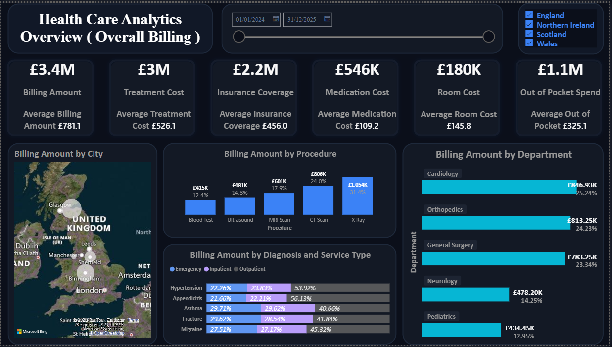

# 🏥 Healthcare Provider Analytics Dashboard — Power BI


> An interactive Power BI dashboard providing a comprehensive view of healthcare provider operations — tracking patient costs, billing, insurance coverage, length of stay, satisfaction scores, and departmental performance across a multi-provider healthcare network.

---

## 📋 Table of Contents

1. [Executive Summary](#executive-summary)
2. [Objective](#objective)
3. [Dataset Description](#dataset-description)
4. [Data Model](#data-model)
5. [DAX Measures](#dax-measures)
6. [Dashboard Walkthrough](#dashboard-walkthrough)
7. [How to Use the Report](#how-to-use-the-report)
8. [Download & Setup](#download--setup)

---

## Executive Summary

This Power BI report analyses a healthcare provider dataset spanning **patients, visits, providers, departments, diagnoses, procedures, and insurance** across a network of cities. It surfaces key operational and financial metrics through a single-page interactive dashboard designed to support hospital administrators, finance teams, and clinical leads.

**Headline KPIs:**

| KPI | Description |
|---|---|
| 💰 Total Billing Amount | Sum of treatment, medication, and room costs |
| 🛡️ Total Insurance Coverage | Total insurance-covered portion of billing |
| 💸 Out of Pocket | Patient-borne costs after insurance |
| 👥 Total Patients | Distinct patients with recorded visits |
| 🛏️ Average Length of Stay | Average days admitted per visit |
| ⭐ Avg Patient Satisfaction | Average satisfaction score across all visits |
| 👤 Avg Patient Age | Mean age across the patient population |

---

## Objective

The goal of this project is to build a clean, interactive healthcare analytics dashboard that answers the following business questions:

1. What is the total billing exposure and how is it split between treatment, medication, and room costs?
2. How much of the billing is covered by insurance, and what is the average out-of-pocket burden per patient?
3. Which departments and procedures drive the highest billing volumes?
4. How do providers compare on cost, patient satisfaction, and length of stay?
5. What are the demographic and geographic patterns across the patient population?
6. How does billing and utilisation trend over time?

---

## Dataset Description

The model is built on **eight raw CSV datasets** stored in the `/Dataset` folder of this repository.

---

### 🏥 visits.csv — Visits (Fact Table)

The primary transaction-level dataset containing every patient visit record.

| Column | Type | Description |
|---|---|---|
| `Date of Visit` | DateTime | Date and time the patient visit occurred |
| `Patient ID` | Integer | Foreign key to the patients dimension |
| `Provider ID` | Integer | Foreign key to the providers dimension |
| `Department ID` | Integer | Foreign key to the departments dimension |
| `Diagnosis ID` | Integer | Foreign key to the diagnoses dimension |
| `Procedure ID` | Integer | Foreign key to the procedures dimension |
| `Insurance ID` | Integer | Foreign key to the insurance dimension |
| `Service Type` | Text | Type of service delivered |
| `Treatment Cost` | Currency | Cost of treatment for the visit |
| `Medication Cost` | Currency | Cost of medications prescribed |
| `Insurance Coverage` | Currency | Amount covered by insurance |
| `Room Charges(daily rate)` | Currency | Daily room charge rate |
| `Length_of_stay` | Integer | Number of days admitted |
| `Room Type` | Text | Category of room (e.g., Private, Shared) |
| `Patient Satisfaction Score` | Integer | Patient-reported satisfaction (numeric scale) |
| `Referral Source` | Text | How the patient was referred |
| `Emergency Visit` | Text/Boolean | Whether visit was an emergency |
| `Payment Status` | Text | Payment state (e.g., Paid, Pending) |
| `Admitted Date` | Date | Date of hospital admission |
| `Discharge Date` | Date | Date of discharge |
| `Follow-Up Visit Date` | Date | Scheduled follow-up date |

> **Note:** `Total room Charge` is a calculated column derived as `Room Charges(daily rate) × Length_of_stay`, computed via SUMX in DAX rather than stored as a raw column.

---

### 👤 patients.csv — Patients (Dimension)

Demographics for each unique patient.

| Column | Type | Description |
|---|---|---|
| `Patient ID` | Integer | Unique patient identifier |
| `Patient Name` | Text | Full name of the patient |
| `Gender` | Text | Patient gender |
| `Age` | Integer | Patient age in years |
| `City ID` | Integer | Foreign key to the cities dimension |
| `Race` | Text | Patient ethnicity/race |

---

### 🩺 providers.csv — Providers (Dimension)

Details of healthcare providers in the network.

| Column | Type | Description |
|---|---|---|
| `Provider ID` | Integer | Unique provider identifier |
| `Provider Name` | Text | Full name of the provider |
| `Gender` | Text | Provider gender |
| `Nationality` | Text | Provider nationality |
| `Age` | Integer | Provider age |
| `Image` | Text | Path or URL to provider photo |

---

### 🏙️ cities.csv — Cities (Dimension)

Geographic reference for patient locations.

| Column | Type | Description |
|---|---|---|
| `City ID` | Integer | Unique city identifier |
| `City` | Text | City name |
| `State` | Text | State or region |
| `Country` | Text | Country |

---

### 🏢 departments.csv — Departments (Dimension)

Hospital department reference table.

| Column | Type | Description |
|---|---|---|
| `Department ID` | Integer | Unique department identifier |
| `Department Name` | Text | Name of the department (e.g., Cardiology, Oncology) |

---

### 🔬 procedures.csv — Procedures (Dimension)

Medical procedure reference table.

| Column | Type | Description |
|---|---|---|
| `Procedure ID` | Integer | Unique procedure identifier |
| `Procedure Name` | Text | Name of the medical procedure |

---

### 🛡️ insurance.csv — Insurance (Dimension)

Insurance provider reference table.

| Column | Type | Description |
|---|---|---|
| `Insurance ID` | Integer | Unique insurance identifier |
| `Insurance Provider` | Text | Name of the insurance company |

---

### 🔍 diagnoses.csv — Diagnoses (Dimension)

Medical diagnosis reference table.

| Column | Type | Description |
|---|---|---|
| `Diagnosis ID` | Integer | Unique diagnosis identifier |
| `Diagnosis Name` | Text | Name of the diagnosis |

---

## Data Model

The report follows a **Star Schema** with `visits` as the central fact table, surrounded by seven dimension tables. The `patients` table bridges to `cities` via a secondary relationship, creating a small snowflake extension.


```
                    ┌──────────────────────────┐
                    │       Date_tbl (Dim)      │
                    │  Date, Month, Year         │
                    │  MonthNum, Quarter, Week  │
                    └────────────┬─────────────┘
                          1 (active: Date of Visit)
                          * (inactive: Admitted Date)
┌───────────────┐   ┌────────────▼──────────────────────────────────────┐   ┌──────────────────┐
│  departments  │   │               visits (Fact)                    │   │   procedures     │
│ 1 Dept ID  ◄─┼───┤* Dept ID    Date of Visit   Treatment Cost      ├──►│ 1 Procedure ID  │
│  Dept Name    │   │  Patient ID   Provider ID   Medication Cost     │   │   Procedure Name │
└───────────────┘   │  Diagnosis ID  Insurance ID  Insurance Coverage │   └──────────────────┘
┌───────────────┐   │  Room Charges  Length_of_stay  Satisfaction    │   ┌──────────────────┐
│  diagnoses    │   │  Service Type  Room Type  Emergency Visit        │   │   insurance      │
│ 1 Diag ID  ◄─┼───┤* Diag ID      Payment Status  Admitted Date   ├──►│ 1 Insurance ID   │
│  Diag Name    │   └───────────────────┬───────────────────────────┘   │   Ins. Provider  │
└───────────────┘                         │ *                             └──────────────────┘
                                        │ (Patient ID)
                                        │ 1
                    ┌───────────────────▼──────────────────┐
                    │           patients (Dim)               │
                    │  Patient ID, Name, Gender, Age, Race  │
                    └───────────────────┬──────────────────┘
                                        │ *
                                        │ (City ID)
                                        │ 1
                    ┌───────────────────▼──────────────────┐
                    │           cities (Dim)                 │
                    │  City ID, City, State, Country        │
                    └──────────────────────────────────────┘
```

### Relationship Details

| From Table | From Column | To Table | To Column | Cardinality | Active |
|---|---|---|---|---|---|
| visits | `Date of Visit` | Date_tbl | `Date` | Many-to-One | ✅ |
| visits | `Admitted Date` | Date_tbl | `Date` | Many-to-One | ❌ (inactive) |
| visits | `Patient ID` | patients | `Patient ID` | Many-to-One | ✅ |
| visits | `Provider ID` | providers | `Provider ID` | Many-to-One | ✅ |
| visits | `Department ID` | departments | `Department ID` | Many-to-One | ✅ |
| visits | `Diagnosis ID` | diagnoses | `Diagnosis ID` | Many-to-One | ✅ |
| visits | `Procedure ID` | procedures | `Procedure ID` | Many-to-One | ✅ |
| visits | `Insurance ID` | insurance | `Insurance ID` | Many-to-One | ✅ |
| patients | `City ID` | cities | `City ID` | Many-to-One | ✅ |

### Supporting Tables

| Table | Type | Purpose |
|---|---|---|
| `Dax calculations` | Measures Table | Central repository for all 21 DAX measures |
| `Patient Location Switch` | Field Parameter | Dynamically toggle patient geographic dimension (City / State / Country) |

---

## DAX Measures

All 21 measures are housed in the `Dax calculations` table, organised into three display folders.

### Basic KPIs

| Measure | DAX Expression | Purpose |
|---|---|---|
| **Total_Meidcation_cost** | `SUM(visits[Medication Cost])` | Total medication costs across all visits |
| **Total_treatment_cost** | `SUM(visits[Treatment Cost])` | Total treatment costs across all visits |
| **Total room cost** | `SUMX(visits, ROUND(visits[Room Charges(daily rate)] * visits[Length_of_stay], 0))` | Total room charges calculated as daily rate × length of stay |
| **Total Billing Amount** | `[Total_Meidcation_cost] + [Total_treatment_cost] + [Total room cost]` | Aggregate patient billing (medication + treatment + room) |
| **Total_insurance_coverage** | `SUM(visits[Insurance Coverage])` | Total insurance-covered portion of billing |
| **Out of Pocket** | `[Total Billing Amount] - [Total_insurance_coverage]` | Patient-borne cost after insurance deduction |
| **Percentage Of Grand Total** | `DIVIDE([Total Billing Amount], CALCULATE([Total Billing Amount], ALL(procedures)))` | Billing share relative to all procedures |
| **Percentage of grand total (dept)** | `DIVIDE([Total Billing Amount], CALCULATE([Total Billing Amount], ALL(departments)))` | Billing share relative to all departments |

### Major KPIs

| Measure | DAX Expression | Purpose |
|---|---|---|
| **Average Treatment Cost** | `AVERAGE(visits[Treatment Cost])` | Mean treatment cost per visit |
| **Average Medication Cost** | `AVERAGE(visits[Medication Cost])` | Mean medication cost per visit |
| **Average Room Cost** | `AVERAGEX(visits, ROUND(visits[Room Charges(daily rate)] * visits[Length_of_stay], 0))` | Mean room cost per visit using row-level calculation |
| **Average Billing Amount** | `[Average Medication Cost] + [Average Treatment Cost] + [Average Room Cost]` | Mean total bill per visit |
| **Average Insurance Coverage** | `AVERAGE(visits[Insurance Coverage])` | Mean insurance payout per visit |
| **Average Out of Pocket** | `[Average Billing Amount] - [Average Insurance Coverage]` | Mean patient-borne cost per visit |
| **Average Length of stay** | `AVERAGE(visits[Length_of_stay])` | Mean number of days admitted per visit |
| **Average Patient satisfaction Score** | `AVERAGE(visits[Patient Satisfaction Score])` | Mean patient satisfaction rating |
| **Average Patient Age** | `AVERAGE(patients[Age])` | Mean age across all patients |

### Average KPIs (Patient Level)

| Measure | DAX Expression | Purpose |
|---|---|---|
| **Total Patients** | `DISTINCTCOUNT(visits[Patient ID])` | Count of unique patients with recorded visits |
| **Avergae Billing amount per patient** | `DIVIDE([Total Billing Amount], [Total Patients])` | Average total bill across unique patients |
| **Avergae Out of Pocket per patient** | `DIVIDE([Out of Pocket], [Total Patients])` | Average out-of-pocket cost per unique patient |

---

## Dashboard Walkthrough

The report delivers an interactive single-page view of healthcare provider performance.



### KPI Header Strip

Key headline metrics across the top of the dashboard provide instant visibility into operational and financial health:

- **Total Billing Amount** — aggregate of treatment, medication, and room costs
- **Total Insurance Coverage** — total insurer-paid portion
- **Out of Pocket** — patient-borne remainder
- **Total Patients** — distinct patient count
- **Average Length of Stay** — mean admission duration in days
- **Average Patient Satisfaction Score** — wean patient rating
- **Average Patient Age** — demographic anchor

---

### Billing Breakdown by Department

A bar or column chart comparing total billing amounts across hospital departments (e.g., Cardiology, Oncology, Orthopaedics), with the `Percentage of grand total (dept)` measure enabling quick share-of-total context.

**Insight:** Identifies which departments are the highest cost centres, guiding resource allocation and pricing review.

---

### Billing by Procedure

A ranked visual showing the top procedures by total billing and their share of grand total via `Percentage Of Grand Total`. Cross-filtering from this chart cascades to all other visuals.

**Insight:** Pinpoints high-revenue procedures and highlights where insurance coverage rates diverge from the average.

---

### Insurance Coverage vs Out of Pocket

A stacked visual contrasting `Total_insurance_coverage` against `Out of Pocket` across insurance providers or departments, surfacing gaps in coverage.

**Insight:** Reveals patient financial burden concentration — critical for patient affordability strategy and insurer negotiation.

---

### Provider Performance

A table or matrix visual breaking down providers by average billing amount, average satisfaction score, average length of stay, and total patient count.

**Insight:** Enables comparison of care efficiency and quality across the provider network.

---

### Patient Demographics

Visuals driven by the `Patient Location Switch` field parameter allow geographic analysis to be toggled between City, State, and Country, alongside breakdowns by Gender, Age, and Race.

**Insight:** Supports population health analysis and targeted outreach by identifying demographic patterns in utilisation and cost.

---

### Trend Analysis

A line chart tracking billing, satisfaction, and patient volume over time using the `Date_tbl` relationship on `Date of Visit`. The inactive relationship on `Admitted Date` can be activated via `USERELATIONSHIP()` for admission-based time intelligence.

---

## How to Use the Report

### Slicers & Filters
Use the page-level slicers to filter by Department, Provider, Insurance Provider, Diagnosis, Service Type, Room Type, and Date of Visit. All visuals cross-filter dynamically.

### Patient Location Switch
He **Patient Location Switch** field parameter lets you toggle the geographic dimension shown in location-based visuals between City, State, and Country without switching pages.

### Cross-Filtering
Click any bar, slice, or table row to cross-filter all other visuals to that selection. Click again or press **Ctrl+Z** to clear the filter.

---

## Download & Setup

### Prerequisites
- **Power BI Desktop** (free) — [Download here](https://powerbi.microsoft.com/en-us/desktop/)
- Windows 10 or later

### Steps to Open the Report

1. **Clone or download this repository:**
   ```
   git clone https://github.com/Anandukaran/PowerBI---Healthcare-analytics.git
   ```
   Or click **Code → Download ZIP** on the repository page.

2. **Navigate to the `Main Files` folder** inside the downloaded repository.

3. **Open** `Health care Dashboard.pbix` **with Power BI Desktop.**

4. The report will load with all data pre-embedded. No additional connection setup is required.

5. *(Optional)* To refresh with new data, replace the dataset files in the `Dataset` folder and update the file paths in **Home → Transform Data → Data Source Settings**.

### File Reference

| File | Location | Description |
|---|---|---|
| `Health care Dashboard.pbix` | `/Main Files/` | Power BI report file |
| `visits.csv` | `/Dataset/` | Fact table — patient visit records |
| `patients.csv` | `/Dataset/` | Patient demographics |
| `providers.csv` | `/Dataset/` | Healthcare provider details |
| `departments.csv` | `/Dataset/` | Department reference |
| `diagnoses.csv` | `/Dataset/` | Diagnosis reference |
| `procedures.csv` | `/Dataset/` | Medical procedure reference |
| `insurance.csv` | `/Dataset/` | Insurance provider reference |
| `cities.csv` | `/Dataset/` | City/State/Country geographic reference |
| Dashboard Screenshot | `/Images/` | PNGexport of the report page |
| Data Model Screenshot | `/Images/` | PNG of the Power BI data model view |

---

<div align="center">

**Built with ❤️ using Power BI Desktop**

[⬆ Back to Top](#️-healthcare-provider-analytics-dashboard--power-bi)

</div>
